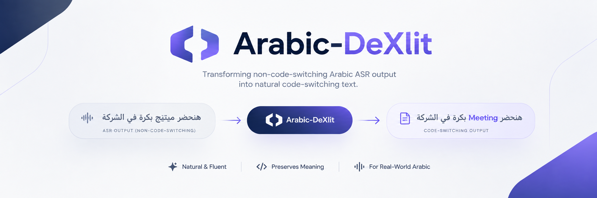
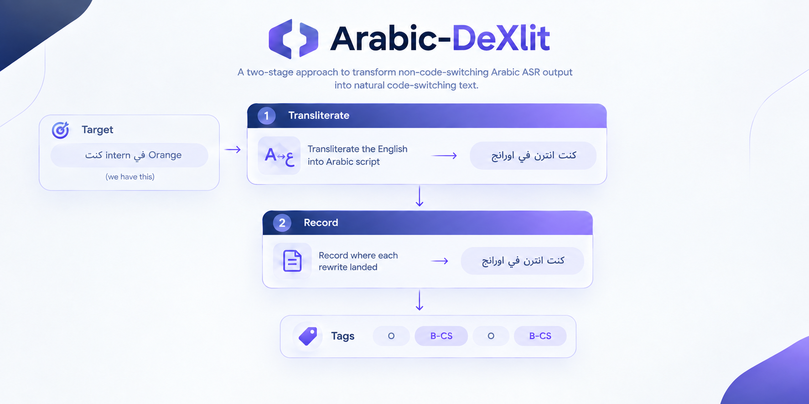

<div align="center">



<br>

[](https://colab.research.google.com/github/MohammedAly22/Arabic-DeXlit/blob/main/notebooks/ArabicDeXlit_Train_Colab.ipynb)
[](https://huggingface.co/datasets/mohammedaly22/ArabicDeXlit-Corpus)
[](https://huggingface.co/mohammedaly22)

[](https://github.com/MohammedAly22/Arabic-DeXlit)
[](https://www.python.org)
[](https://pytorch.org)
[](https://wandb.ai)
[](LICENSE)
[](https://creativecommons.org/licenses/by-sa/4.0/)

### 🚀 [Train it on Colab](https://colab.research.google.com/github/MohammedAly22/Arabic-DeXlit/blob/main/notebooks/ArabicDeXlit_Train_Colab.ipynb) &nbsp;·&nbsp; 📊 [Dataset](https://huggingface.co/datasets/mohammedaly22/ArabicDeXlit-Corpus) &nbsp;·&nbsp; 🧠 [How it works](#-how-it-works) &nbsp;·&nbsp; ⚡ [Quick start](#-quick-start)

</div>

---

## 🎯 The problem

Arabic ASR models handle code-switching badly. When a speaker says an English word, the model
writes it with **Arabic letters**. The transcript is phonetically reasonable and practically
useless — you cannot search it, index it, or hand it to an English NLP tool.

<table>
<tr><th align="left">❌ What the ASR gives you</th></tr>
<tr><td dir="rtl">

أول شغل ليا بعد التخرج كنت **انترن** في **او اي اي** اللي هي **اورانج انوفيشن ايجيبت** و بعدها بكام شهر جالي **اوفر**

</td></tr>
<tr><th align="left">✅ What Arabic-DeXlit gives back</th></tr>
<tr><td dir="rtl">

أول شغل ليا بعد التخرج كنت **`intern`** في **`OIE`** اللي هي **`Orange Innovation Egypt`** و بعدها بكام شهر جالي **`offer`**

</td></tr>
</table>

And the part that makes it safe to deploy:

<table>
<tr><th align="left">🔒 Pure Arabic in</th><th align="left">🔒 Pure Arabic out</th></tr>
<tr>
<td dir="rtl">أنا رايح البيت دلوقتي عشان تعبان</td>
<td dir="rtl">أنا رايح البيت دلوقتي عشان تعبان</td>
</tr>
<tr><td colspan="2" align="center"><i>byte-for-byte identical — guaranteed by construction, not by training</i></td></tr>
</table>

---

## 🧠 How it works

**One end-to-end model.** The noisy sentence goes in, the corrected sentence comes out. Every
decision is made by the decoder's cross-attention — when it emits `Presentation` it is attending to
`البريزنتيشن`, and when it emits `ال` it is attending to `ال`.

```
كنت انترن في او اي اي اللي هي اورانج انوفيشن ايجيبت
                    │
                    ▼   ByT5  (byte-level encoder-decoder)
                    │
كنت intern في OIE اللي هي Orange Innovation Egypt
```

### Why byte-level

The vocabulary is **256 symbols**, so nothing is ever out of vocabulary. That is not a detail here:

| | |
|:--|:--|
| `C++` | three bytes — not an unknown token |
| `الsystem` | no word segmentation needed to understand it |
| an unseen brand name | representable exactly, always |
| `ميتينج` / `ميتنج` / `ميطنغ` | a small edit in byte space, not three unrelated entries |

Published comparisons find byte-level ByT5 substantially ahead of subword mT5 on transliteration
and other spelling-sensitive tasks — which is precisely this task. The cost is sequence length
(Arabic is ~2 bytes per character), but measured on this corpus the 99th percentile is 393 bytes,
so a 512-byte budget covers effectively every sentence.

### Why this replaced a five-component pipeline

The previous design split stage 2 across parsers, a gazetteer, an acronym inventory, phonetic
retrieval and a span converter. Each saw only a fragment of the sentence, and the failures followed
directly from that:

| Input | Old pipeline | End-to-end |
|:--|:--|:--|
| `سي بلاس بلاس` | `Scele leles` | **`C++`** |
| `المانجر` | `manager` (article lost) | **`ال Manager`** |
| `البريزنتيشن` | *skipped entirely* | **`ال Presentation`** |
| `ايفالويشن` | `finish` | evaluation |
| `ال` | `I'll` | `ال` |

Every one of those is a *context* failure. The information needed was in the sentence; it simply
never reached the component making the decision.

Verified on real ByT5-small in 120 steps: **3/4 of those exact cases correct**, including `C++` and
the fused article, with pure Arabic returned unchanged.

### The metric that matters

Sentence exact-match is reported, but **Unnecessary Modification Rate** is what decides whether the
model is deployable: of the tokens that should have been left alone, how many were changed. A
rewriter that improves conversion while quietly corrupting ordinary Arabic is worse than none, and
exact-match cannot tell the two apart. Checkpoints are selected on `sentence_exact − UMR`.

## ⚡ Quick start

### ☁️ Train it on Colab

[](https://colab.research.google.com/github/MohammedAly22/Arabic-DeXlit/blob/main/notebooks/ArabicDeXlit_Train_Colab.ipynb)

Click the badge and run the notebook top to bottom. It pulls the prebuilt corpus from the Hub, runs
a one-minute smoke test, trains both stages, and evaluates.

| GPU | Model | Approx. time |
|:--|:--|:--|
| 🟢 A100 40GB | `google/byt5-base` (580M) | ~4–6 h, 3 epochs |
| 🟡 L4 / 🔵 T4 | `google/byt5-small` (300M) | pass `--model-name google/byt5-small` |

Byte-level sequences are long, so this is slower than a subword model — that is the price of
letting one model see the whole sentence.

### 💻 Train locally

```bash
git clone https://github.com/MohammedAly22/Arabic-DeXlit.git
cd Arabic-DeXlit
pip install -r requirements.txt

# 1. Pull the prebuilt corpus (~68 MB) from the Hub
python -c "import sys; sys.path.insert(0,'src'); \
from arabic_dexlit.data.hub import download_corpus; download_corpus()"

# 2. Train the end-to-end rewriter
python scripts/train.py --stage seq2seq --config configs/seq2seq_base.yaml

# 3. Evaluate on the held-out test set
python scripts/evaluate.py --model-dir outputs/dexlit-s2s --data data/processed/test.jsonl
```

### 🐍 Use a trained model

```python
from transformers import AutoTokenizer, AutoModelForSeq2SeqLM
from arabic_dexlit.model.seq2seq import Seq2SeqConfig, generate

cfg = Seq2SeqConfig()
tok = AutoTokenizer.from_pretrained("outputs/dexlit-s2s/seq2seq")
model = AutoModelForSeq2SeqLM.from_pretrained("outputs/dexlit-s2s/seq2seq").cuda().eval()

generate(model, tok, ["كنت انترن في او اي اي و بعدها جالي اوفر"], cfg, device="cuda")
# ['كنت intern في OIE و بعدها جالي Offer']

generate(model, tok, ["أنا رايح البيت دلوقتي"], cfg, device="cuda")
# ['أنا رايح البيت دلوقتي']   <- unchanged
```

---

## 📊 The dataset

[](https://huggingface.co/datasets/mohammedaly22/ArabicDeXlit-Corpus)

```python
from datasets import load_dataset
ds = load_dataset("mohammedaly22/ArabicDeXlit-Corpus")
```

| | |
|:--|:--|
| 📦 **Examples** | 475,945 (train 428,376 · validation 23,601 · test 23,968) |
| 🌍 **Dialects** | 8 — MSA, Egyptian, Gulf, Levantine, Iraqi, Maghrebi, Sudanese, Yemeni |
| 🔒 **Pass-through rows** | 30% — pure Arabic where the correct answer is *change nothing* |
| 🏷️ **Labelled spans** | 1,383,667 |
| ⚖️ **License** | CC-BY-SA-4.0 |

### 🔄 The core idea: invert the corpus

Parallel data for this task barely exists. But corpora of the **target** form — Arabic with English
correctly in Latin script — are plentiful. So the pipeline runs the problem backwards:

<div align="center">

</div>

This matters for **correctness**, not just convenience. Because spans are recorded *during*
generation rather than recovered afterwards by alignment, the labels cannot silently drift out of
sync with the text — the failure mode that quietly poisons hand-aligned corpora.

The transliterator is deliberately **stochastic**, because real ASR is inconsistent:

| English | Sampled Arabic forms |
|:--|:--|
| `intern` | `انترن` · `انتيرن` · `انترين` |
| `meeting` | `ميتينج` · `ميتنج` · `ميتينغ` |
| `project` | `بروجكت` · `برجكت` · `بروجيكت` |

Training across epochs therefore exposes the model to the variation it will actually meet, instead
of one canonical spelling it could memorise.

### 📚 Sources

| Source | Contribution | License |
|:--|:--|:--|
| [SDAIA ArE-CSTD](https://huggingface.co/datasets/SDAIANCAI/Ar-En-Code-Switching-Textual-Dataset) | 310,578 rows — MSA, Saudi, Egyptian | CC-BY-SA-4.0 |
| Gemini synthesis | 22,584 rows — the missing dialects and rare categories | generated here |
| Arabic Wikipedia + dialectal ASR transcripts | 142,783 rows — pass-through examples | CC-BY-SA |

> **Why synthesis was needed.** SDAIA covers three dialects and is almost entirely plain word-level
> code-switching. Measured over 20K of its sentences: ~60,000 ordinary spans but only **178
> acronyms, 9 entities and zero emails or numbers**. Generation was aimed narrowly at those gaps,
> not at bulk volume SDAIA already supplies.

> **Why external monolingual text was needed.** SDAIA is ~99% code-switched by construction, so it
> cannot supply the pass-through half of the task. Those rows are additionally **screened**: a
> sentence already containing transliterated English (`الميتينغ`, `الويكند`) is rejected, since
> using it as a pass-through example would teach the exact opposite of the task.

### ✅ Verified quality

Each checked on the released build, not assumed:

| Check | Result |
|:--|:--|
| Sentence-family overlap, train ∩ test | **0** ✅ |
| Sentence-family overlap, train ∩ validation | **0** ✅ |
| Rows where `len(tags) != len(src_tokens)` | **0** ✅ |
| Tags outside the 11-tag schema | **0** ✅ |
| Pass-through rows where `src != tgt` | **0** ✅ |

Splits are assigned by hashing a *normalised* sentence key, so families of near-identical sentences
(common in LLM-generated corpora) cannot straddle a split and inflate the score.

---

## 📈 Monitoring

Training logs to [Weights & Biases](https://wandb.ai). Beyond loss and accuracy, four diagnostics
are plotted at every evaluation:

| Plot | What it answers |
|:--|:--|
| 🎨 **Edit decisions** | *Which words does the model change?* The sentence, each token shaded by the edit chosen, disagreements underlined in red. |
| 🔍 **Attention** | What the encoder actually attends to, last layer, head-averaged. |
| 🧩 **Tag confusion** | Which tag is being confused with which, row-normalised. |
| 🛡️ **Safety curves** | Pass-through accuracy and false-edit rate across training. |

### ⚠️ The two metrics that matter

| Metric | Meaning | Target |
|:--|:--|:--|
| `passthrough_accuracy` | Of sentences that must be returned untouched, the fraction that were. | **≥ 0.99** |
| `false_edit_rate` | Share of ordinary tokens the model wanted to edit. | **≤ 0.01** |

A model with excellent F1 and poor pass-through accuracy is **unusable** — it corrupts ordinary
Arabic. Checkpoints are therefore selected on a composite score:

```
score = span_f1 − 0.5 × false_edit_rate
```

---

## 📁 Repository layout

```
src/arabic_dexlit/
├── model/
│   └── seq2seq.py         🧠  ByT5 end-to-end rewriter (the model)
├── data/
│   ├── translit.py        🔤  English → Arabic script (manufactures inputs)
│   ├── pairing.py         🔗  builds aligned (input, target) pairs
│   ├── real_cs.py         🗣️  harvests REAL human code-switching (ArzEn)
│   ├── vocab.py           📚  the vocabulary speakers actually switch into
│   ├── vocab_inject.py    💉  places that vocabulary into dialectal carriers
│   ├── sources.py         📥  corpus acquisition + monolingual screening
│   ├── synth.py           ✨  Gemini synthesis for missing dialects
│   ├── build.py           🧱  leak-free splitting and assembly
│   └── hub.py             ☁️  pull the prebuilt corpus from the Hub
└── training/
    ├── train_seq2seq.py   🎓  fine-tuning loop, UMR-selected checkpoints
    ├── dataset.py         📦  row loading and balanced subsetting
    └── metrics.py         📊  UMR, conversion accuracy, per-category

scripts/    build_dataset.py · synthesize_data.py · export_dataset.py · train.py · evaluate.py
configs/    seq2seq_base.yaml
notebooks/  ArabicDeXlit_Train_Colab.ipynb
tests/      test_pairing.py · test_seq2seq.py
```

## 🧪 Tests

```bash
python tests/test_pairing.py    # data invariants
python tests/test_models.py     # model shapes, gradients, decoding
python tests/test_pipeline.py   # protection layer, acronyms, UMR metric
python tests/test_hybrid.py     # parsers, rules, gazetteer, routing
```

The data tests assert the invariants that would otherwise fail **silently** — tag/token alignment,
span round-tripping, and that pure Arabic is an exact identity.

---

## ⚖️ Licensing

Code is **Apache-2.0**. The corpus is **CC-BY-SA-4.0**, inherited from SDAIA's share-alike term.

One deliberate exclusion: [Casablanca](https://huggingface.co/datasets/UBC-NLP/Casablanca) is an
excellent multi-dialect corpus that annotates code-switched words in *both* scripts, but it is
CC-BY-**NC-ND**. The no-derivatives term forbids republishing transliterated derivatives, so it is
not part of the released dataset. It remains suitable as a held-out evaluation set, cited rather
than redistributed.

## 📄 Citation

```bibtex
@misc{arabicdexlit2026,
  title  = {Arabic-DeXlit: Undoing Transliteration in Arabic ASR Code-Switching},
  author = {Mohammed Aly},
  year   = {2026},
  url    = {https://github.com/MohammedAly22/Arabic-DeXlit}
}
```

<div align="center">

Built on [SDAIA ArE-CSTD](https://huggingface.co/datasets/SDAIANCAI/Ar-En-Code-Switching-Textual-Dataset)
and [MARBERTv2](https://huggingface.co/UBC-NLP/MARBERTv2).

⭐ **Star this repo** if it helps your Arabic speech work.

</div>
